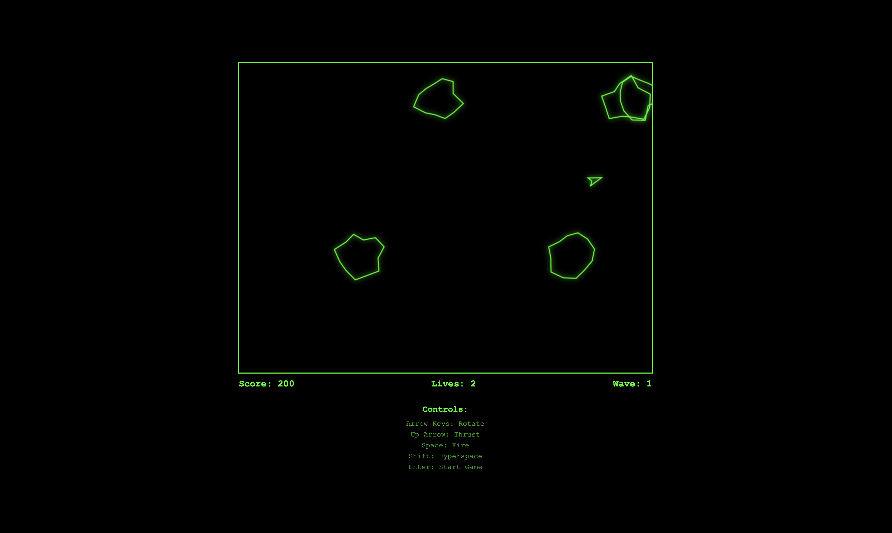

# Asteroids Game

A faithful recreation of the classic 1979 Atari Asteroids arcade game built with HTML5 Canvas and vanilla JavaScript. Features authentic vector-style graphics, realistic physics, and retro sound effects.

## Screenshot



*Note: Add a screenshot by taking a picture of the game in action and saving it as `screenshot.png` in the root directory.*

## Features

### Core Gameplay
- **Vector Graphics**: Authentic vector-style rendering with glow effects
- **Realistic Physics**: Inertia-based movement system requiring strategic planning
- **Asteroid Fragmentation**: Large asteroids split into medium, then small pieces
- **Screen Wrapping**: Seamless movement across screen boundaries
- **Multiple Waves**: Increasing difficulty with each completed wave

### Enemies and Combat
- **UFO Enemies**: Two types with different behaviors and point values
  - Large UFO: 200 points, less accurate shooting
  - Small UFO: 1000 points, highly accurate targeting
- **Smart AI**: UFOs predict player movement for challenging gameplay
- **Collision Detection**: Precise circle-based collision system

### Visual and Audio Effects
- **Particle Systems**: Explosion effects and engine thrust particles
- **Procedural Audio**: Web Audio API generated retro sound effects
- **Screen Effects**: Glowing vector graphics with authentic CRT-style appearance
- **Smooth Animation**: 60 FPS gameplay with deltaTime-based updates

### Game Systems
- **Scoring System**: Traditional point values (Large: 20, Medium: 50, Small: 100)
- **Extra Lives**: Bonus life awarded every 10,000 points
- **Hyperspace**: Emergency teleportation with risk of destruction
- **Invulnerability**: Brief protection period after respawn

## Controls

| Input | Action |
|-------|--------|
| Left Arrow / A | Rotate ship left |
| Right Arrow / D | Rotate ship right |
| Up Arrow / W | Thrust forward |
| Space | Fire bullets |
| Shift | Hyperspace teleport |
| Enter | Start game / Restart |

## Installation and Setup

### Prerequisites
- Modern web browser with HTML5 Canvas support
- No additional dependencies required

### Running the Game
1. Clone or download the repository
2. Open `asteroids-game/index.html` in your web browser
3. Click anywhere on the page to initialize audio
4. Press Enter to start playing

### File Structure
```
asteroids-game/
├── index.html              # Main HTML file
├── css/
│   └── style.css           # Game styling and UI
├── js/
│   ├── game.js             # Main game loop and logic
│   ├── physics.js          # Physics and math utilities
│   ├── audio.js            # Web Audio API sound system
│   └── entities/
│       ├── entity.js       # Base entity class
│       ├── ship.js         # Player ship implementation
│       ├── asteroid.js     # Asteroid entities and fragmentation
│       ├── bullet.js       # Projectile system
│       ├── ufo.js          # Enemy UFO implementation
│       └── particle.js     # Particle effects system
└── assets/
    ├── sprites/            # Game sprites (to be added)
    └── sounds/             # Audio files (to be added)
```

## Technical Implementation

### Architecture
- **Entity-Component System**: Modular design with base Entity class
- **Vector Mathematics**: Custom Vector2 class for 2D calculations
- **Game Loop**: RequestAnimationFrame with delta time interpolation
- **Input System**: Event-driven keyboard handling with cooldowns

### Physics System
- **Collision Detection**: Circle-based collision using distance calculations
- **Movement**: Velocity-based positioning with friction and speed limits
- **Screen Wrapping**: Seamless boundary transitions
- **Realistic Inertia**: Objects maintain momentum requiring strategic control

### Audio System
- **Web Audio API**: Procedurally generated retro sound effects
- **Dynamic Mixing**: Real-time audio synthesis for authentic 8-bit sounds
- **Browser Compatibility**: Graceful fallback for unsupported browsers

### Performance Optimizations
- **Efficient Rendering**: Minimal draw calls with canvas state management
- **Object Pooling**: Reusable particle systems
- **Delta Time**: Frame-rate independent updates
- **Collision Optimization**: Spatial partitioning for large object counts

## Game Rules

### Scoring
- Large Asteroid: 20 points
- Medium Asteroid: 50 points
- Small Asteroid: 100 points
- Large UFO: 200 points
- Small UFO: 1000 points

### Lives and Progression
- Start with 3 lives
- Extra life awarded at 10,000 points and every 10,000 thereafter
- Game over when all lives are lost
- Waves increase in difficulty with more asteroids

### Special Mechanics
- **Hyperspace**: 10% chance of self-destruction
- **UFO Spawning**: Appears every 30 seconds when no UFOs present
- **Invulnerability**: 3-second protection after respawn or hyperspace
- **Wave Completion**: New wave starts 2 seconds after clearing all asteroids

## Browser Compatibility

### Supported Browsers
- Chrome 50+ (recommended)
- Firefox 45+
- Safari 10+
- Edge 79+

### Required Features
- HTML5 Canvas 2D Context
- Web Audio API (for sound)
- ES6 Classes and Arrow Functions
- RequestAnimationFrame

## Development

### Code Style
- ES6+ JavaScript with classes
- Modular architecture with separate entity files
- Consistent naming conventions
- No external dependencies

### Adding Features
1. Extend the Entity base class for new game objects
2. Add update and draw methods for custom behavior
3. Register entities in the main game loop
4. Implement collision detection as needed

### Performance Monitoring
- Use browser dev tools for frame rate analysis
- Monitor memory usage for particle systems
- Check audio context performance on mobile devices

## Known Issues

### Audio
- Some browsers require user interaction before audio can play
- Safari may have reduced audio quality on older versions

### Mobile
- Touch controls not implemented (keyboard only)
- Performance may vary on lower-end mobile devices

## Contributing

1. Fork the repository
2. Create a feature branch
3. Implement your changes
4. Test across different browsers
5. Submit a pull request

## License

This project is open source and available under the MIT License.

## Acknowledgments

- Original Asteroids game by Atari (1979)
- Lyle Rains and Ed Logg for the original game design
- Vector graphics inspiration from classic arcade machines
- Web Audio API examples and documentation